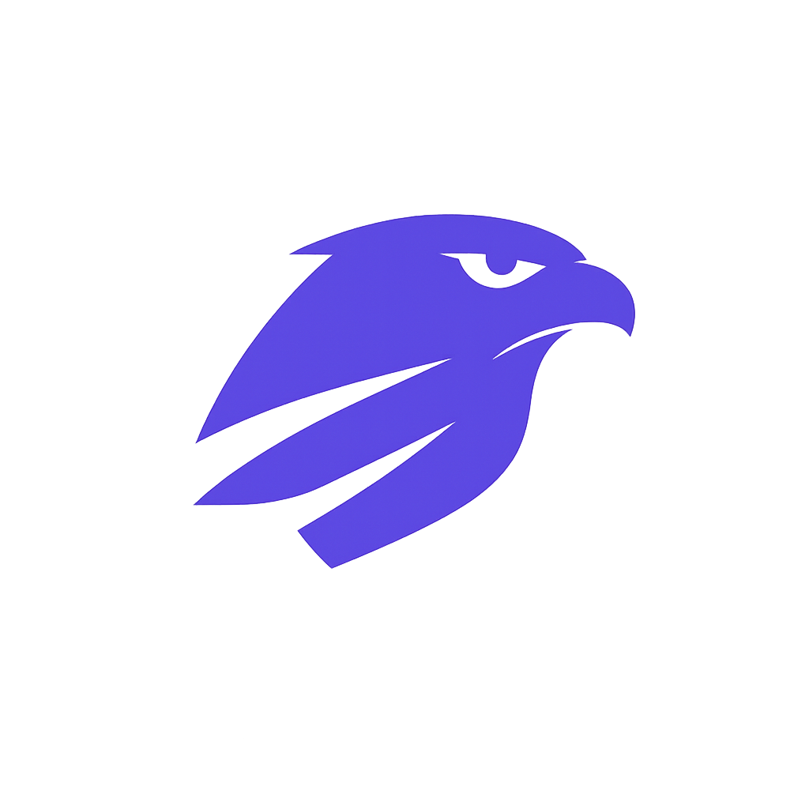

<p align="center">
  
</p>

<h1 align="center">Falcon</h1>

<p align="center">
  CLI for generating images with <a href="https://fal.ai">fal.ai</a>
</p>

---

Supports multiple models, batch generation, upscaling, and background removal.

## Installation

### Quick Install (Recommended)

```bash
curl -fsSL https://raw.githubusercontent.com/howells/falcon/main/install.sh | bash
```

### Manual Install

Requires [Bun](https://bun.sh) runtime.

```bash
git clone https://github.com/howells/falcon.git
cd falcon
bun install
bun link
```

## Configuration

Set your fal.ai API key:

```bash
export FAL_KEY="your-api-key"
```

Or add it to `~/.falcon/config.json`:

```json
{
  "apiKey": "your-api-key"
}
```

Get your API key at [fal.ai/dashboard/keys](https://fal.ai/dashboard/keys).

### Config Options

| Option | Default | Description |
|--------|---------|-------------|
| `apiKey` | - | Your fal.ai API key |
| `defaultModel` | `banana` | Default generation model |
| `defaultAspect` | `1:1` | Default aspect ratio |
| `defaultResolution` | `2K` | Default resolution |
| `openAfterGenerate` | `true` | Auto-open images after generation |
| `upscaler` | `clarity` | Upscaler model (`clarity` or `crystal`) |
| `backgroundRemover` | `rmbg` | Background removal model (`rmbg` or `bria`) |

You can also create a `.falconrc` file in any directory to override settings per-project.

## Usage

### Generate Images

```bash
# Basic generation
falcon "a cat sitting on a windowsill at sunset"

# Specify model
falcon "cyberpunk cityscape" -m banana

# Set aspect ratio and resolution
falcon "mountain landscape" -a 16:9 -r 4K

# Generate multiple images
falcon "abstract art" -n 4

# Use presets
falcon "book cover design" --cover      # Kindle: 2:3, 2K
falcon "profile picture" --square       # 1:1
falcon "desktop wallpaper" --landscape  # 16:9
falcon "phone wallpaper" --portrait     # 2:3

# Social media presets
falcon "instagram story" --story        # 9:16 (1080×1920)
falcon "insta reel cover" --reel        # 9:16
falcon "feed post" --feed               # 4:5 (1080×1350)
falcon "blog preview" --og              # Open Graph: 16:9

# Transparent images (GPT model only)
falcon "logo on transparent background" --transparent -m gpt
```

### Edit Images

```bash
# Edit an existing image with a prompt
falcon "add a rainbow in the sky" -e ./photo.png
```

### Post-Processing

```bash
# Show last generation info
falcon --last

# Generate variations of last image
falcon --vary
falcon --vary -n 4  # 4 variations

# Upscale last image
falcon --up
falcon --up --scale 4  # 4x upscale

# Remove background from last image
falcon --rmbg
```

### Interactive Studio

Run `falcon` without arguments to launch the interactive terminal UI:

```bash
falcon
```

## Models

### Generation Models

All models support image editing with the `-e` flag.

| Model | Name | Pricing | Features |
|-------|------|---------|----------|
| `banana` | Nano Banana Pro | $0.15-$0.30/image | Aspect, resolution (default) |
| `gpt` | GPT Image 1.5 | $0.01-$0.20/image | Variable quality settings |
| `gemini` | Gemini 2.5 Flash | $0.039/image | Fast, affordable |
| `gemini3` | Gemini 3 Pro | $0.15-$0.30/image | Highest quality |

### Utility Models

| Model | Name | Use |
|-------|------|-----|
| `clarity` | Clarity Upscaler | Default upscaler |
| `crystal` | Crystal Upscaler | Alternative upscaler |
| `rmbg` | BiRefNet | Background removal |
| `bria` | Bria RMBG 2.0 | Background removal |

## Options Reference

```
Usage: falcon [prompt] [options]

Options:
  -m, --model <model>      Model: gpt, banana, gemini, gemini3
  -e, --edit <file>        Edit an existing image with prompt
  -a, --aspect <ratio>     Aspect ratio (see below)
  -r, --resolution <res>   Resolution: 1K, 2K, 4K
  -o, --output <file>      Output filename
  -n, --num <count>        Number of images (1-4)
  --transparent            Transparent PNG (GPT model only)
  --no-open                Don't auto-open image after generation

Post-processing:
  --last                   Show last generation info
  --vary                   Generate variations of last image
  --up                     Upscale last image
  --rmbg                   Remove background from last image
  --scale <factor>         Upscale factor: 2, 4, 6, 8 (with --up)

Presets:
  Format:
    --cover                Kindle/eBook cover: 2:3, 2K
    --square               Square: 1:1
    --landscape            Landscape: 16:9
    --portrait             Portrait: 2:3

  Social Media:
    --story                Instagram/TikTok Story: 9:16
    --reel                 Instagram Reel: 9:16
    --feed                 Instagram Feed: 4:5
    --og                   Open Graph / social share: 16:9

  Devices:
    --wallpaper            iPhone wallpaper: 9:16, 2K

  Cinematic:
    --wide                 Cinematic wide: 21:9
    --ultra                Ultra-wide banner: 21:9, 2K
```

### Aspect Ratios

`21:9` | `16:9` | `3:2` | `4:3` | `5:4` | `1:1` | `4:5` | `3:4` | `2:3` | `9:16`

## Cost Tracking

Falcon tracks your spending automatically:

```
Session: $0.52 | Today: $1.24
```

View your history in `~/.falcon/history.json`.

## License

MIT
